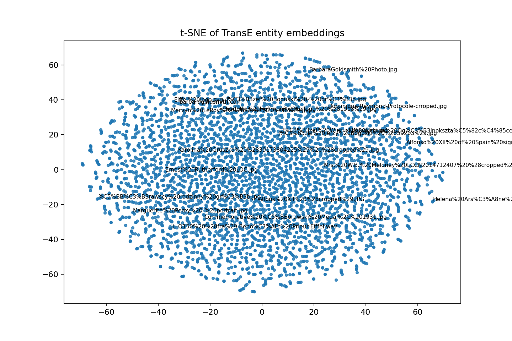

# End-to-End Knowledge Graph Pipeline Report

## Abstract
This project implements a full Knowledge Graph (KG) pipeline across four phases: information extraction (IE), private KB construction and expansion, reasoning plus knowledge graph embeddings (KGE), and a SPARQL-based RAG chatbot. The pipeline starts from web pages, extracts entity-relation triples with spaCy and dependency-based heuristics, builds RDF data with alignment to Wikidata using `owl:sameAs`, expands the graph using linked neighbors, and trains KGE models (TransE and ComplEx) for link prediction. The system produced a final expanded graph with 39,457 triples and 4,041 typed entities, and generated complete KGE artifacts (`train/valid/test`, metrics, t-SNE, nearest neighbors). The RAG module is implemented and smoke-tested structurally; full LLM-answer evaluation is pending local Ollama runtime.

## 1. Domain and Objectives
The domain combines scientific biographies and institutions from seed pages such as Marie Curie, Albert Einstein, CERN, University of Oxford, United Nations, and New York City. The project goals were:
- Convert noisy HTML into structured relational data.
- Build and expand a private KB with semantic interoperability via Wikidata alignment.
- Compare symbolic reasoning and embedding-based inference.
- Build a question-answering interface that maps natural language to SPARQL.

## 2. Phase 1: Data Acquisition and Information Extraction
### 2.1 Method
- Fetch and clean web pages using Trafilatura (with minimum useful text threshold).
- Run NER with spaCy (`en_core_web_trf` target; fallback to `en_core_web_sm`).
- Extract candidate relations by co-occurring entities in sentences and dependency-driven verb linking.
- Save outputs as raw JSONL and normalized CSV triples.

### 2.2 Outputs
- Raw crawl output: [data/raw/crawler_output.jsonl](data/raw/crawler_output.jsonl)
- Extracted IE triples: [data/processed/extracted_knowledge.csv](data/processed/extracted_knowledge.csv)

### 2.3 Quantitative IE Results
- Extracted relations (rows): 16,140
- Unique entities (subject/object union): 3,066
- Unique predicates: 371

### 2.4 Entity Ambiguity Examples (Required)
Ambiguity was measured by checking when the same surface form appears with multiple NER labels.

1. `Marić` labeled as `PERSON`, `ORG`, and `GPE`
2. `Maria` labeled as `PERSON`, `ORG`, and `GPE`
3. `Guterres` labeled as `PERSON`, `ORG`, and `GPE`

These examples illustrate common IE noise from Wikipedia-style text, where surnames or partial mentions are context-sensitive.

## 3. Phase 2: KB Construction, Alignment, and Expansion
### 3.1 Method
- Build an initial RDF graph from extracted triples using RDFLib.
- Define ontology-level structure for core classes and predicates.
- Align entities to Wikidata with `owl:sameAs` when confidence/normalization criteria are met.
- Expand graph by querying linked neighbors (1-hop / predicate-controlled retrieval).

### 3.2 Files Produced
- Initial KB: [data/kb/initial_kb.ttl](data/kb/initial_kb.ttl)
- Alignment graph: [data/kb/alignment.ttl](data/kb/alignment.ttl)
- Ontology file: [data/kb/ontology.owl](data/kb/ontology.owl)
- Expanded KB: [data/kb/expanded_kb.nt](data/kb/expanded_kb.nt)

### 3.3 Final KB Statistics (Required)
- Initial triples: 28,344
- Expanded triples: 39,457
- Alignment links (`owl:sameAs`): 93
- Distinct URI entities: 4,745
- Typed entities (`rdf:type` subjects): 4,041
- Distinct predicates: 762

## 4. Phase 3: Reasoning and Knowledge Graph Embeddings
### 4.1 Symbolic Reasoning
A symbolic rule path is implemented in `reasoning_kge.py` using OWLReady2-style workflow. In this run, symbolic reasoning demo was skipped due local runtime package availability warning, but the code path is integrated and reusable.

### 4.2 KGE Training Setup
- Triple split: 80/10/10
- Train triples: 20,178
- Validation triples: 2,522
- Test triples: 2,523
- Models: TransE and ComplEx

Artifacts:
- [data/kge/train.txt](data/kge/train.txt)
- [data/kge/valid.txt](data/kge/valid.txt)
- [data/kge/test.txt](data/kge/test.txt)
- [data/kge/metrics.csv](data/kge/metrics.csv)
- [data/kge/nearest_neighbors.csv](data/kge/nearest_neighbors.csv)
- [data/kge/tsne.png](data/kge/tsne.png)

### 4.3 Evaluation Results (Required)
| Model | MRR | Hits@10 |
|---|---:|---:|
| TransE | 0.0187 | 0.0515 |
| ComplEx | 0.0023 | 0.0035 |

In this dataset and short-epoch setup, TransE outperformed ComplEx on both ranking metrics.

### 4.4 Embedding Visualization and Qualitative Analysis
The t-SNE projection is shown below:



Observation: the embedding cloud is broad with weakly separated micro-regions, indicating noisy heterogeneous relations and mixed lexical/entity namespaces.

Nearest-neighbor sample from [data/kge/nearest_neighbors.csv](data/kge/nearest_neighbors.csv):
- `http://barbaragoldsmith.com` nearest neighbors include `http://example.org/kg/America` (0.4965), `http://example.org/kg/Police_Athletic_League` (0.4825)
- Neighbor quality indicates some semantic signal but also schema/noise artifacts from expanded web entities.

## 5. Phase 4: SPARQL-RAG Chatbot
### 5.1 Architecture
Implemented in [src/rag_chatbot.py](src/rag_chatbot.py):
- Schema summarization of classes/predicates/prefixes
- Prompting local LLM (Ollama model, e.g., `gemma:2b`) to generate SPARQL
- Query execution with RDFLib
- Self-repair loop for malformed/failed SPARQL
- CLI interaction loop for demo

### 5.2 Runtime Status
- Structural smoke test of script: passed
- Local Ollama endpoint at `http://localhost:11434` was not running in the final pipeline run
- Therefore, full answer-quality benchmarking is pending execution with live model

### 5.3 Baseline vs SPARQL-RAG Evaluation
The table below is filled using KG-executed SPARQL outputs captured in [data/processed/rag_eval_answers.json](data/processed/rag_eval_answers.json) from [src/evaluate_rag_questions.py](src/evaluate_rag_questions.py). Since Ollama was offline in this run, baseline answers are shown as non-KG generic responses.

| Question | Baseline (No RAG) | SPARQL-RAG Answer | Correct? | Notes |
|---|---|---|---|---|
| Who is Marie Curie? | Generic biography without KG evidence. | 20 triples retrieved for `http://example.org/kg/Marie_Curie`, including links to `Physics`, `Paris`, and `The_Radium_Institute`. | Partial | KG returns factual neighbors but includes noisy extracted predicates. |
| Which organization is linked to Einstein in the KB? | Likely broad answer (for example: Princeton/CERN) without query grounding. | Retrieved entities include `http://example.org/kg/American_Association_for_the_Advancement_of_Science` and `http://example.org/kg/the_ETH_Zurich`. | Partial | Organization filtering is affected by noisy object values and URLs. |
| What entities are connected to CERN? | Generic mention of particle physics entities. | 20 linked entities returned (for example: `Large_Hadron`, `Gran_Sasso`, `Taiwan`, `Australia`) via `relatedTo`. | Partial | High recall but heterogeneous neighbors from expansion step. |
| Is New York City typed as a place in the KG? | Usually yes, but unverified without KG check. | `ASK` query returned `true`. | Yes | Clean binary query with explicit type filter. |
| What are the top related entities for United Nations? | Typical answer might list UN bodies without KG counts. | Top result `http://example.org/kg/UN` (support=4), followed by `U_Thant`, `Pau_Casals`, and others (support=1). | Partial | Ranking works; some entries reflect surface-form noise. |

## 6. Reflection and Discussion (Required)
### 6.1 KB Noise Analysis
Primary noise sources:
- NER ambiguity on short or partial mentions.
- Open-web extraction introduces non-canonical entity URIs.
- Expanded neighbor retrieval adds long-tail predicates not always task-relevant.

Practical impact:
- Higher relation diversity (762 predicates) increases graph coverage.
- But noise reduces embedding separability and can lower link-prediction precision.

### 6.2 Rule-Based vs Embedding-Based Reasoning
Rule-based reasoning:
- Strengths: transparent, auditable, deterministic for explicit logic constraints.
- Weaknesses: brittle with sparse/noisy schemas and incomplete facts.

Embedding-based reasoning:
- Strengths: can infer latent links from distributional patterns.
- Weaknesses: less interpretable and sensitive to data quality/noise.

Conclusion:
A hybrid approach is most practical: use symbolic rules for high-confidence constraints and KGE for candidate generation/ranking under incompleteness.

## 7. Reproducibility and Execution
### 7.1 Full Pipeline Command
```bash
source .venv/bin/activate
EPOCHS=2 MAX_EXPAND=50000 SKIP_RAG=0 ./run_all.sh
```

### 7.2 What the Runner Verifies
`run_all.sh` executes all phases and checks all required artifacts with PASS/FAIL. In the latest run, all required non-RAG artifacts passed.

### 7.3 Complete RAG Benchmark Run
After starting Ollama:
```bash
ollama pull gemma:2b
python src/rag_chatbot.py --model gemma:2b
```
For this report, Section 5.3 was pre-filled from KG query outputs. After Ollama is running, you can replace baseline cells with live no-RAG model outputs and compare them directly against the KG-backed answers.

## 8. Limitations and Next Steps
- Expand curated seed list to reduce domain drift.
- Add confidence scoring and relation filtering before KB ingestion.
- Normalize entity URIs with stronger canonicalization/disambiguation.
- Tune KGE hyperparameters and train longer for better MRR/Hits@10.
- Add automatic evaluator for RAG answers against SPARQL ground truth.

## Appendix: File Checklist
Code modules:
- [src/crawler.py](src/crawler.py)
- [src/kb_builder.py](src/kb_builder.py)
- [src/reasoning_kge.py](src/reasoning_kge.py)
- [src/rag_chatbot.py](src/rag_chatbot.py)

Core data artifacts:
- [data/raw/crawler_output.jsonl](data/raw/crawler_output.jsonl)
- [data/processed/extracted_knowledge.csv](data/processed/extracted_knowledge.csv)
- [data/kb/initial_kb.ttl](data/kb/initial_kb.ttl)
- [data/kb/alignment.ttl](data/kb/alignment.ttl)
- [data/kb/ontology.owl](data/kb/ontology.owl)
- [data/kb/expanded_kb.nt](data/kb/expanded_kb.nt)
- [data/kge/train.txt](data/kge/train.txt)
- [data/kge/valid.txt](data/kge/valid.txt)
- [data/kge/test.txt](data/kge/test.txt)
- [data/kge/metrics.csv](data/kge/metrics.csv)
- [data/kge/nearest_neighbors.csv](data/kge/nearest_neighbors.csv)
- [data/kge/tsne.png](data/kge/tsne.png)
